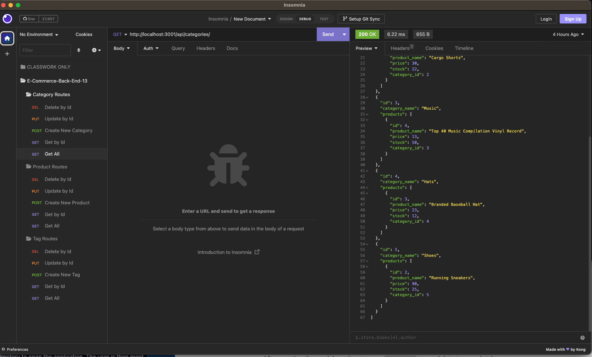

# E-Commerce-Back-End-13

## Description

This project is an e-commerce back end implementation that takes a working Express.js API and configures it to use Sequelize to interact with a MySQL database.  Since e-commerce is the largest sector of the electronics industry, this project was built to consider an internet retail company while taking on the User Story: 
"AS A manager at an internet retail company
I WANT a back end for my e-commerce website that uses the latest technologies
SO THAT my company can compete with other e-commerce companies."

The motivation behind this project was to build a back end for an e-commerce website to make them competitive in the internet retail electronics industry.  This solves the problem of developers needing to understand the prevalence of e-commerce platforms as it informs them of the fundamental architecture of e-commerce sites.  

By building this project, I learned how to apply my lessons learned and knowledge of using the packages of dotenv, express, mysql2, and sequelize to build a back-end to a site.  

## Installation

I ran npm i to install all packages & dependencies.  

This project uses the following packages: 

dotenv ^8.6.0
express ^4.17.1
mysql2 ^2.1.0
sequelize ^5.21.7

## Usage

Steps to running the application: 

    1. Initialize 'ecommerce_db' in SQL workbench with commands in schema.sql file. 
    2. Seed database with data by running 'npm run seed' command. 
    3. Start server by using command 'npm start' or 'node server.js'. 
    4. Use Insomnia to send requests to the server and test server routes for the SQL tables: 'CATEGORY,' 'PRODUCT', and 'TAG.'
        - The following five routes interact with each of the three tables listed above: 
            - Get all [categories, products, tags] (GET)
            - Get by Id  (GET)
            - Create new [category, product, tag] (POST)
            - Update by Id (PUT)
            - Delete by Id (DELETE)
        

PLEASE FIND THE LINK TO THE DEMO VIDEO HERE: https://drive.google.com/file/d/1Ybao7oI56yd51EypyKLMVpKT0u-Oz9nm/view

## Credits

I'd like to thanks my tutors Bobbi Ternaky and Ryan Fernandez for their guidance getting started, encouragement and advice through the coding of this project.  

I would also like to credit my discord study group: 
Emma Daily, Michael Radar, and Michael Huang as we worked side-by-side, and shared code collaboratively to complete this project.  

## License

Please refer to MIT license in repo. 

## Questions

If you have any questions, please contact me directly at pkfalberto@gmail.com.
